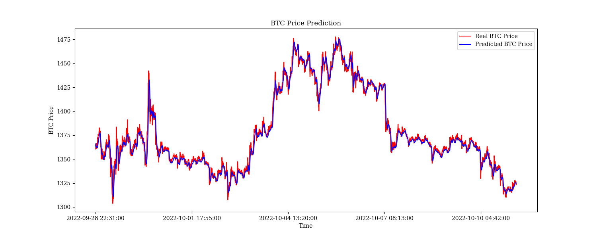

# Crypto Price Prediction Using LSTM
This project involves using machine learning to predict cryptocurrency prices.  
The steps in this project include:
- Loading the data
- Cleansing and transforming the data
- Training the LSTM model
- Making predictions using the trained LSTM model  
### Example Output

